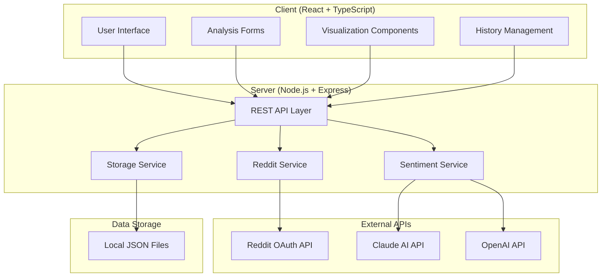

# Design Document

## Overview

The Reddit Sentiment Analyzer is architected as a modern full-stack web application with a React TypeScript frontend and Node.js Express backend. The system integrates with external APIs (Reddit, Claude AI, OpenAI) to provide comprehensive sentiment analysis capabilities with real-time data processing, interactive visualizations, and persistent storage.

## Architecture

### High-Level Architecture



### Technology Stack

**Frontend:**
- React 18 with TypeScript for type safety and modern UI patterns
- Recharts for interactive data visualizations
- Axios for HTTP client communication
- Custom CSS for responsive design
- Create React App for build tooling

**Backend:**
- Node.js with Express.js for RESTful API server
- Axios for external API communication
- File system-based JSON storage for simplicity
- CORS middleware for cross-origin requests
- Environment variable configuration

**External Integrations:**
- Reddit OAuth 2.0 API for data fetching
- Claude AI API (primary) for sentiment analysis
- OpenAI API (fallback) for sentiment analysis

## Components and Interfaces

### Frontend Components

#### Core Application Components

**App.tsx**
- Main application container with routing logic
- Navigation state management
- Global error boundary
- Theme and layout management

**AnalysisForm.tsx**
- User input collection for analysis parameters
- Form validation and submission
- Real-time parameter feedback
- Progress indication during analysis

**Results.tsx**
- Tabbed interface for analysis results
- Overview, timeline, subreddit comparison, and detailed views
- Export functionality integration
- Dynamic content rendering based on analysis data

#### Visualization Components

**SentimentChart.tsx**
- Pie chart for overall sentiment distribution
- Interactive legend with percentage breakdowns
- Responsive design for different screen sizes

**TimelineChart.tsx**
- Line chart showing sentiment trends over time
- Multi-series data for positive/negative/neutral trends
- Date range zoom and pan capabilities

**SubredditComparison.tsx**
- Bar charts comparing sentiment across subreddits
- Average score comparisons
- Volume and engagement metrics

**PostsList.tsx**
- Detailed tabular view of individual posts and comments
- Sortable columns for score, sentiment, date
- Expandable comment sections
- Individual sentiment score indicators

#### Utility Components

**Settings.tsx**
- API key configuration interface
- Connection testing functionality
- Runtime environment variable updates
- Service status indicators

**History.tsx**
- Saved analysis management
- Search and filter capabilities
- Analysis metadata display
- Load and delete operations

### Backend Services

#### API Layer (index.js)

**Core Endpoints:**
- `POST /api/analyze` - Main analysis orchestration
- `GET /api/health` - System health monitoring
- `GET /api/settings` - Configuration status
- `POST /api/test-keys` - API connection testing

**Analysis Storage Endpoints:**
- `GET /api/analyses` - List saved analyses
- `GET /api/analyses/:id` - Retrieve specific analysis
- `POST /api/analyses` - Save new analysis
- `DELETE /api/analyses/:id` - Remove analysis

#### Service Layer Architecture

**RedditService.js**
```javascript
class RedditService {
  // OAuth 2.0 authentication management
  async authenticate()
  
  // Parallel subreddit data fetching
  async fetchSubredditData(subreddits, startDate, endDate, postLimit)
  
  // Individual subreddit post retrieval
  async fetchSubredditPosts(subreddit, limit, timeframe)
  
  // Comment fetching with nested reply handling
  async fetchPostComments(postId, subreddit, limit)
  
  // Connection validation
  async testConnection()
}
```

**SentimentService.js**
```javascript
class SentimentService {
  // Batch sentiment analysis orchestration
  async analyzeSentiment(redditData)
  
  // Claude AI integration with optimized batching
  async analyzeWithClaudeMaximized(texts, maxTextLength)
  
  // OpenAI fallback integration
  async analyzeWithOpenAI(texts)
  
  // Results aggregation and processing
  aggregateResults(individualScores, posts)
  
  // Timeline data generation
  createTimeline(posts, individualScores)
  
  // AI-generated insights
  async generateClaudeInsights(posts)
}
```

**StorageService.js**
```javascript
class StorageService {
  // Analysis persistence
  async saveAnalysis(analysisData, metadata)
  
  // Analysis retrieval
  async getAnalysis(id)
  
  // Analysis listing with metadata
  async getAnalysesList()
  
  // Analysis deletion
  async deleteAnalysis(id)
  
  // File system management
  async ensureDataDir()
}
```

## Data Models

### Core Data Structures

**AnalysisData Interface**
```typescript
interface AnalysisData {
  posts: RedditPost[];
  analysis: SentimentAnalysis;
  summary: {
    totalPosts: number;
    totalComments: number;
    subreddits: string[];
    dateRange: { startDate: string; endDate: string; };
  };
}
```

**RedditPost Interface**
```typescript
interface RedditPost {
  id: string;
  title: string;
  selftext: string;
  score: number;
  num_comments: number;
  created_utc: number;
  subreddit: string;
  permalink: string;
  url: string;
  author: string;
  comments: RedditComment[];
}
```

**SentimentAnalysis Interface**
```typescript
interface SentimentAnalysis {
  overall_analysis: {
    average_score: number;
    sentiment_distribution: { positive: number; neutral: number; negative: number; };
    dominant_themes: string[];
    key_emotions: string[];
    summary: string;
  };
  individual_scores: SentimentScore[];
  by_subreddit: { [subreddit: string]: SubredditAnalysis; };
  timeline: TimelineData[];
  claude_insights?: { [subreddit: string]: string; };
}
```

### Data Flow Architecture

**Analysis Pipeline:**
1. **Input Validation** - Validate subreddits, date ranges, and limits
2. **Reddit Data Fetching** - Parallel subreddit processing with comment retrieval
3. **Text Extraction** - Collect post titles, bodies, and comment text
4. **Batch Processing** - Group texts for efficient AI API usage
5. **Sentiment Analysis** - Process batches through Claude/OpenAI APIs
6. **Result Aggregation** - Combine individual scores into comprehensive analysis
7. **Insight Generation** - Generate AI-powered community insights
8. **Response Formatting** - Structure data for frontend consumption

## Error Handling

### Error Categories and Strategies

**API Integration Errors:**
- Reddit API authentication failures → Retry with exponential backoff
- Rate limit exceeded → Implement request queuing and delays
- Invalid subreddit names → Continue processing valid subreddits
- AI API failures → Fallback between Claude and OpenAI

**Data Processing Errors:**
- Malformed Reddit responses → Skip invalid posts/comments
- JSON parsing failures → Implement robust parsing with fallbacks
- Memory constraints → Process data in smaller batches

**User Input Errors:**
- Invalid date ranges → Provide clear validation messages
- Missing API keys → Guide users to configuration settings
- Network connectivity → Implement offline mode indicators

### Error Response Format

```typescript
interface ErrorResponse {
  success: false;
  error: string;
  details?: string;
  code?: string;
  retryable?: boolean;
}
```

## Testing Strategy

### Frontend Testing

**Component Testing:**
- React Testing Library for component behavior
- Mock API responses for isolated testing
- Snapshot testing for UI consistency
- User interaction testing with user-event

**Integration Testing:**
- End-to-end analysis workflow testing
- API integration testing with mock servers
- Error scenario testing
- Performance testing with large datasets

### Backend Testing

**Unit Testing:**
- Service layer testing with mocked dependencies
- Data transformation testing
- Error handling validation
- Configuration testing

**API Testing:**
- Endpoint testing with various input scenarios
- Authentication testing
- Rate limiting testing
- Error response validation

**Integration Testing:**
- External API integration testing
- File system operations testing
- End-to-end analysis pipeline testing

### Performance Testing

**Load Testing:**
- Multiple concurrent analysis requests
- Large dataset processing
- Memory usage monitoring
- API rate limit compliance

**Optimization Testing:**
- Batch processing efficiency
- Parallel processing performance
- Cache effectiveness
- Response time optimization

## Security Considerations

### API Key Management
- Environment variable storage for production
- Runtime configuration for development
- No client-side API key exposure
- Secure key validation and testing

### Data Privacy
- No persistent user data storage
- Temporary analysis data cleanup
- Reddit API compliance
- AI API data usage policies

### Input Validation
- Subreddit name sanitization
- Date range validation
- Parameter limit enforcement
- SQL injection prevention (though using JSON storage)

## Performance Optimizations

### Reddit API Optimization
- Parallel subreddit fetching
- Batch comment retrieval with controlled concurrency
- Intelligent rate limiting
- Connection pooling and reuse

### AI API Optimization
- Batch processing (200 texts per Claude request)
- Text length optimization (800 characters max)
- Model selection based on batch size
- Fallback API implementation

### Frontend Optimization
- Component memoization for expensive renders
- Lazy loading for large datasets
- Virtual scrolling for post lists
- Chart rendering optimization

### Storage Optimization
- JSON file compression
- Analysis metadata separation
- Automatic cleanup of old analyses
- Efficient file I/O operations